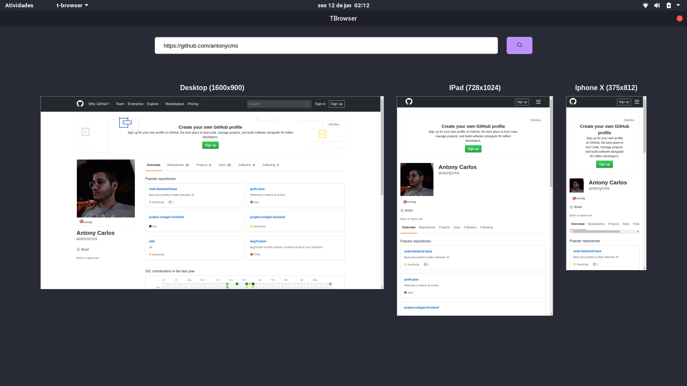

<h1 align="center">TBrowser 👋</h1>

<div align="center">
  
</div>

<p align="center">
  
  
  
  <a href="https://github.com/kefranabg/readme-md-generator#readme" target="_blank">
    
  </a>
  <a href="https://github.com/antonycms/t-browser/graphs/commit-activity" target="_blank">
    
  </a>
  <a href="https://github.com/antonycms/t-browser/blob/master/LICENSE" target="_blank">
    
  </a>
</p>

> Um mini navegador, criado com Electron e React, para desenvolvimento, com múltiplos tamanhos de tela!

### 🏠 [Homepage](https://github.com/antonycms/t-browser)


## Requisitos

- npm >=6.14.4
- node >=12.17.0

## Tecnologias
- Nodejs
- Typescript
- Electron
- React

## Lints
- Prettier
- Eslint
- Editorconfig

#
## Instalação

```sh
yarn install
```
ou
```sh
npm install
```
#
## Rodando o projeto

```sh
yarn dev
```
ou
```sh
npm run dev
```

#
## Gerando uma build do projeto

```sh
yarn dist
```
ou
```sh
npm run dist
```

#
👤 **Antony Santos**

* Github: [@antonycms](https://github.com/antonycms)

## Deixe seu suporte

Deixe uma ⭐️ se esse projeto ajudou você!

## 📝 Licença

Copyright © 2020 [Antony Santos](https://github.com/antonycms).<br />
Este projeto possui licença [MIT](https://github.com/antonycms/t-browser/blob/master/LICENSE).

***
_Este README foi gerado utilizando [readme-md-generator](https://github.com/kefranabg/readme-md-generator) ❤️_